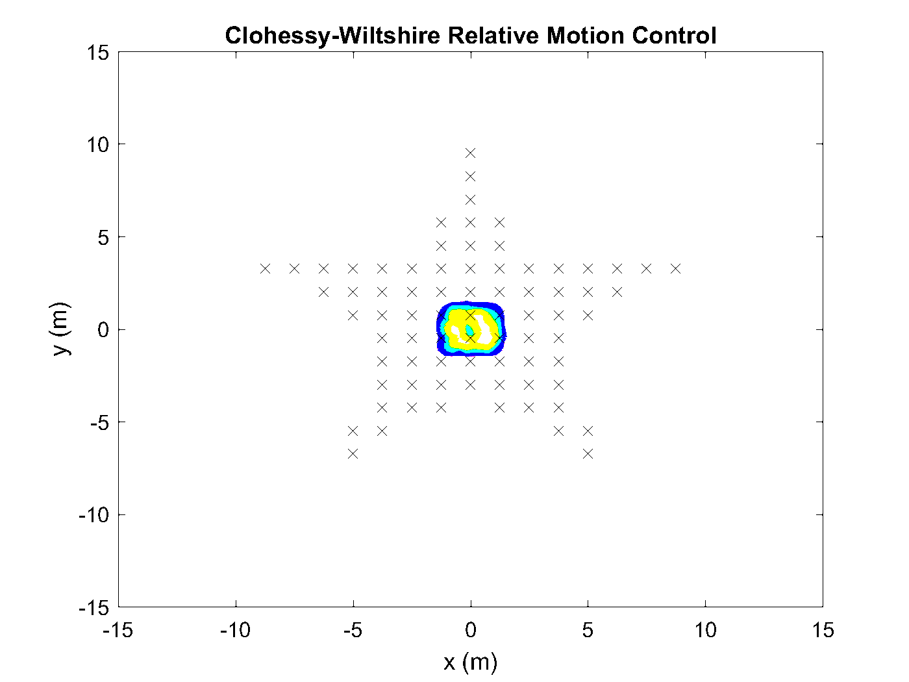

ILQR and MPC Swarm Control using Random Finite Set Theory
Applied to the Clohessy-Wiltshire Relative Motion Model and Acceleration Model

MATLAB Code by Bryce Doerr doerr024(at)umn.edu

Algorithm used in the paper "Random Finite Set Theory and Optimal Control for Large Spacecraft Swarms"
by: Bryce Doerr, Richard Linares, Pingping Zhu, Silvia Ferrari
https://arxiv.org/abs/1810.00696

See the README for each implmentation

The GIF below shows a visualization of the RFS Control for the Clohessy-Wiltshire Relative Motion Problem. The swarm contains 77 agents that move into a star formation. 

Other papers used:
ILQR algorithm is based on Yuval Tassa's implementation
https://www.mathworks.com/matlabcentral/fileexchange/52069-ilqg-ddp-trajectory-optimization
Tassa, Yuval, Tom Erez, and Emanuel Todorov. "Synthesis and stabilization of complex behaviors through online trajectory optimization." Intelligent Robots and Systems (IROS), 2012 IEEE/RSJ International Conference on. IEEE, 2012.

RFS Formulation based on Ba-Ngu Vo
Vo, Ba-Ngu, and Wing-Kin Ma. "The Gaussian mixture probability hypothesis density filter." IEEE Transactions on signal processing 54.11 (2006): 4091.

Other Code used:
-GIF Plotting by Nicolae CINDEA from https://www.mathworks.com/matlabcentral/fileexchange/17463-movie-to-gif-converter?s_tid=prof_contriblnk
-Adapted code from Polygon point Plotting by Sulimon Sattari from https://ww2.mathworks.cn/matlabcentral/fileexchange/41454-grid-of-points-within-a-polygon

Copyright 2018 Bryce Doerr

Permission is hereby granted, free of charge, to any person obtaining a copy of this software and associated documentation files (the "Software"), to deal in the Software without restriction, including without limitation the rights to use, copy, modify, merge, publish, distribute, sublicense, and/or sell copies of the Software, and to permit persons to whom the Software is furnished to do so, subject to the following conditions:

The above copyright notice and this permission notice shall be included in all copies or substantial portions of the Software.

THE SOFTWARE IS PROVIDED "AS IS", WITHOUT WARRANTY OF ANY KIND, EXPRESS OR IMPLIED, INCLUDING BUT NOT LIMITED TO THE WARRANTIES OF MERCHANTABILITY, FITNESS FOR A PARTICULAR PURPOSE AND NONINFRINGEMENT. IN NO EVENT SHALL THE AUTHORS OR COPYRIGHT HOLDERS BE LIABLE FOR ANY CLAIM, DAMAGES OR OTHER LIABILITY, WHETHER IN AN ACTION OF CONTRACT, TORT OR OTHERWISE, ARISING FROM, OUT OF OR IN CONNECTION WITH THE SOFTWARE OR THE USE OR OTHER DEALINGS IN THE SOFTWARE.
